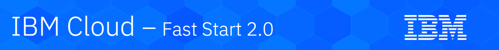

# IBM Cloud 

## Learning at IBM

The content of this repository has been developed to provide an IBM Fast Start 2.0 training session titled:
 
#### <i>&nbsp;&nbsp;&nbsp;&nbsp;Work with Red Hat OpenShift - Lab</i>

The session provides attendees with training related to IBM® Cloud Private, Kubernetes, and Docker.

The training is scheduled to be presented during IBM Fast Start 2.0 - 2019 at locations in North America, Europe, and Asia Pacific.  

---

### Get started with training

[Lab 1 - Installing Minishift](lab1.adoc)

[Lab 2 - Developing a Node.js Application on OpenShift](lab2.adoc)

---
 
