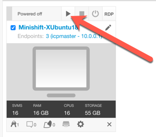
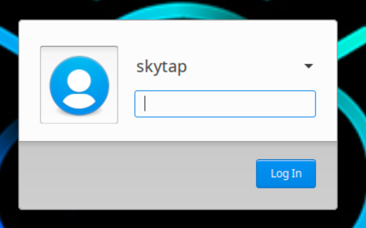
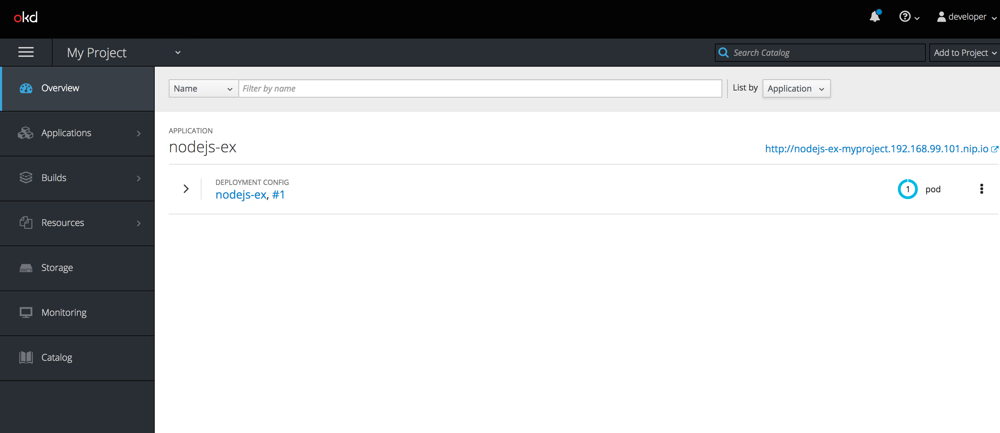

[[minishift]]
= Lab1 Installing Minishift
:icons:
:toc: macro
:toc-title:
:toclevels: 1

toc::[]

[[welcome-to-minishift]]
== Welcome to Minishift!

Minishift is a tool that helps you run OpenShift locally by running a
single-node OpenShift cluster inside a VM. You can try out OpenShift or
develop with it, day-to-day, on your local host.

Minishift uses https://github.com/docker/machine/tree/master/libmachine[libmachine] for
provisioning VMs, and https://github.com/openshift/origin[OpenShift Origin] for running the cluster. The code base is forked from the https://github.com/kubernetes/minikube[Minikube] project.

https://travis-ci.org/minishift/minishift[image:https://secure.travis-ci.org/minishift/minishift.png[Build Status]]
https://ci.appveyor.com/project/minishift-bot/minishift/branch/master[image:https://ci.appveyor.com/api/projects/status/o0mha7mpanp7dpyo/branch/master?svg=true[Build status]]
https://circleci.com/gh/minishift/minishift/tree/master[image:https://circleci.com/gh/minishift/minishift/tree/master.svg?style=svg[Build status]]
https://ci.centos.org/job/minishift/[image:https://ci.centos.org/buildStatus/icon?job=minishift[Build Status]]

'''''

[[getting-started]]
== Getting started

At Fast Start 2019, we will be using a single virtual machine environment in Skytap to host Minishift. Click on the play button to start up your VM.

Once the virtual machine is powered on and running, click on the name of the machine to open the UI in a separate tab in your browser. You should see the following login screen:

`skytap` is a super user on the base Ubuntu operating system. Login to the machine using the password `A1rb0rn3`

Within the image, you can click on the Desktop to open Firefox or Chrome. Firefox has been set as the default browser. It may be helpful to open the labs in the browser for easier copying and pasting of commands below. https://github.com/cattoire/faststart-openshift/blob/master/lab1.adoc

If you are now viewing this lab within the Skytap image browser, you can download the binary for installing Minishift on Linux from https://github.com/minishift/minishift/releases/download/v1.29.0/minishift-1.29.0-linux-amd64.tgz
Save the binary to your Downloads file. This will be used to install Minishift on your virtual machine.

Minishift requires a hypervisor to start the virtual machine on which the OpenShift cluster
is provisioned. In our lab we will use Virtual Box which has already been provided on the virtual machine.

For detailed installation instructions for Minishift and the required dependencies, see
the https://docs.okd.io/latest/minishift/getting-started/index.html[Getting started] documentation.

Open a terminal window in the virtual machine. There is a shortcut to the Terminal on the Desktop. Navigate to the `minishift-lab` directory. +
`cd /~/minishift-lab`

Copy the Minishift binary to the `minishift-lab` directory. +
`cp /~/Downloads/minishift-1.29.0-linux-amd64.tgz /~/minishift-lab`

Extract the content of the tar file with the command : +
`+tar -xvf minishift-1.29.0-linux-amd64.tgz+` +

Copy the Minishift to `/usr/bin` on root. +
`export PATH=/usr/bin/minishift:$PATH`

Add the Minishift binary to your path variable. +
`export PATH=/usr/bin/minishift:$PATH`

Start your minishift instance by executing : +
`+minishift start --vm-driver virtualbox+`

After the server has started you should see something similar to the below

  OpenShift server started.
  The server is accessible via web console at:
       https://192.168.99.128:8443
  You are logged in as:
       User:     developer
       Password: developer
  To login as administrator:
       oc login -u system:admin+`

Try to access the web console using a browser. Your Minishift is now installed.

[[application]]
== Deploy your first application

The first step is to ensure that the oc client is added to your path. Execute :

`+eval $(minishift oc-env)+`

Now you should be able to execute `+oc+`. This will show you the man page for the openshift client.

Create a sample application :

`+oc new-app https://github.com/sclorg/nodejs-ex -l name=myapp+`

Expose the application through a service definition

`+oc expose svc/nodejs-ex+`

Access your application using a browser :

`+minishift openshift service nodejs-ex --in-browser+`

You can also check your application project using the console. Open the console on the right side you should see a default MyProject which was created during setup.

image::myprojects.png[MyProjects]

Click on the My Project entry and open the details

