[[develop]]
= Lab2 Developing a Node.js Application on Openshift
:icons:
:toc: macro
:toc-title:
:toclevels: 1

toc::[]

[[intro]]
== Introduction

=== What you will learn
In this scenario you will learn more about Node.js,
one of the runtimes included in Red Hat OpenShift Application Runtimes.

You will take an existing sample Node.js application and modify it to address microservice concerns,
understand its structure, deploy it to OpenShift and exercise the interfaces between Node.js apps, microservices, and OpenShift/Kubernetes.

=== Redhat Openshift Nodejs runtime support
Node.js is based on the https://developers.google.com/v8/[V8 JavaScript engine] from Google and allows you to write server-side JavaScript applications.
It provides an I/O model based on events and non-blocking operations that enables you to write applications that are both
lightweight and efficient. Node.js also provides a large module ecosystem called https://www.npmjs.com/[npm].
Check out the https://access.redhat.com/documentation/en-us/red_hat_openshift_application_runtimes/1/html-single/node.js_runtime_guide/[Node.js Runtime Guide] for further reading on Node.js and RHOAR.

The Node.js runtime enables you to run Node.js applications and services on OpenShift while providing all the advantages and conveniences of the OpenShift platform such as rolling updates, continuous delivery pipelines, service discovery, and canary deployments. OpenShift also makes it easier for your applications to implement common microservice patterns such as externalized configuration, health check, circuit breaker, and failover.

[[examine-project]]
== Examine the sample project

The sample project shows the components of a Node.js project using Node.js and NPM best practices.

The app implements a simple RESTful microservice which implements a greeting service (that simply returns a Hello greeting).

1) Inspect the application code

Click the links below to open each file and inspect its contents:

- link:src/package.json[package.json] - Metadata about the project: name, version, dependencies, and other information needed to build and maintain the project.
- link:src/app.js[app.js] - Main logic of the sample application defining REST endpoints and application runtime configuration.
- link:src/app-config.yml[app-config.yml] - Content used to initially populate the OpenShift ConfigMap, which the sample app will access at runtime.
- link:src/public/index.html[public/index.html] - Simple web UI to access the greeting service.
- link:src/bin/www[bin/www] - Express framework base server code

Review the content a bit and notice that there are some TODO comments in the code. Do not remove them! The comments are used as marker and without them you will not be able finish the scenario.

The /api/greeting API defined in app.js returns a simple message including an optional name. You will modify this file later on.

2) Install dependencies

Dependencies are listed in the link:src/package.json[package.json] file and declare which external
projects this sample app requires. To download and install them, run the following command:

`+npm install+`

It will take a few seconds to download, and you should see a final report such as added 774 packages in 9.79s

3) Run the application locally

Before we add code to the project you should build and test that current application starts as it should.

Since this is a working application, run the application locally using npm:

`+npm start+`

At this stage the application doesn't really do anything but after a while you will see:

  nodejs-configmap@1.0.0 start /root/projects/rhoar-getting-started/nodejs node .

4) Test the application

Open a browser and point to localhost:8080 You should see :

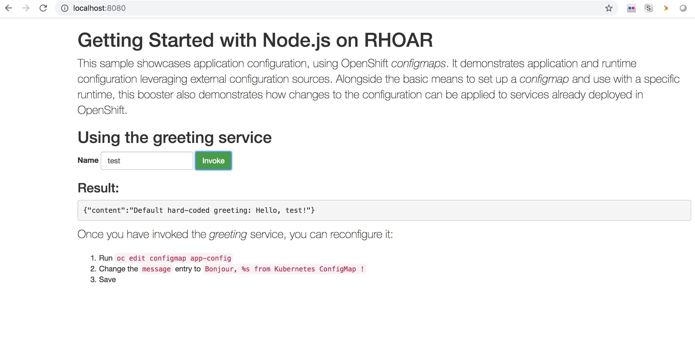

5) Stop the application

Press `+ctrl+C+` in the command window to stop the local node.js server

[[create-project]]
== Create an Openshift Project

Now we will deploy the application we have created to the openshift installation we created in lab 1.

1) Login to OpenShift

In order to login, we will use the oc command and then specify the local server that we want to authenticate to:

`+oc login+`

You should see the below dialog. Use developer/developer as user ad Password

  Authentication required for https://192.168.99.101:8443 (openshift)
  Username: developer
  Password:
  Login successful.
  You have one project on this server: "myproject"
  Using project "myproject".

2) Create an Openshift project

Projects are a top level concept to help you organize your deployments. An OpenShift project allows a community of users (or a user) to organize and manage their content in isolation from other communities. Each project has its own resources, policies (who can or cannot perform actions), and constraints (quotas and limits on resources, etc). Projects act as a wrapper around all the application services and endpoints you (or your teams) are using for your work.

For this scenario, let's create a project that you will use to house your applications.

`+oc new-project example --display-name="Sample Node.js External Config App"+`

3) Work with the Openshift Web Console

OpenShift ships with a web-based console that will allow users to perform various tasks via a browser. To get a feel for how the web console works, open a browser on the address of the openshift server console of lab 1. If you no longer remember the address execute :

`+minishift console+`

Login with developer/developer as user and password

You should see the previously created project.

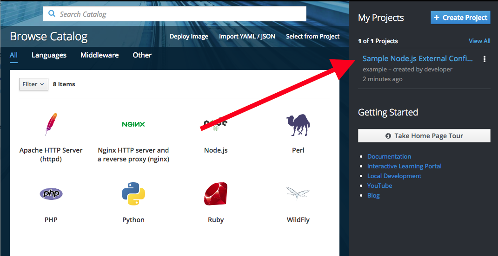

Click on your new project name to be taken to the project overview page which will list all of the routes, services, deployments, and pods that you have running as part of your project:

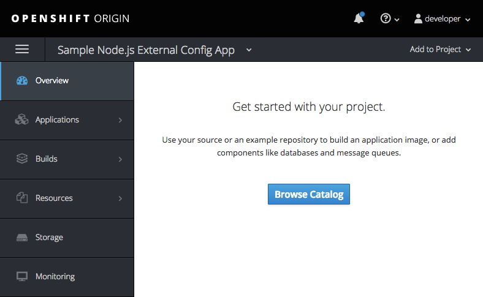

[[deploy-application]]
== Deploy your sample application

Now that you've logged into OpenShift, let's deploy the same sample application as before.

1) Build and deploy

Build and deploy the project using the following command:

`+npm run openshift+`

This uses NPM and the https://github.com/bucharest-gold/nodeshift[Nodeshift] project to build and deploy the sample application to OpenShift using the containerized Node.js runtime. Nodeshift uses the files in the .nodeshift directory of the sample project to create the necessary Kubernetes objects to cause the application to be deployed.

The build and deploy may take a minute or two. Wait for it to complete. You should see INFO done at the end of the build output, and you should not see any obvious errors or failures.

After the build finishes it will take less than a minute for the application to become available. To verify that everything is started, run the following command and wait for it report

`+oc rollout status dc/nodejs-configmap+`

You should see

    replication controller "nodejs-configmap-1" successfully rolled out

2) Access the application running on OpenShift

Go back to the openshift webconsole. In the project page you should now see the application.

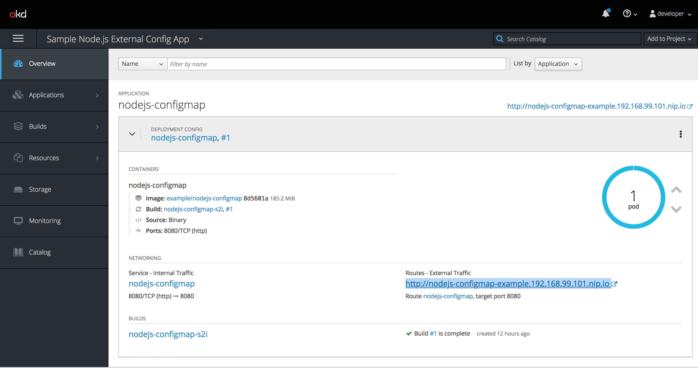

Click on the application route url to access the application in your browser.

Enter a name in the 'Name' field and click Invoke to test out the service. You should get the same hard-coded greeting as in previous steps.

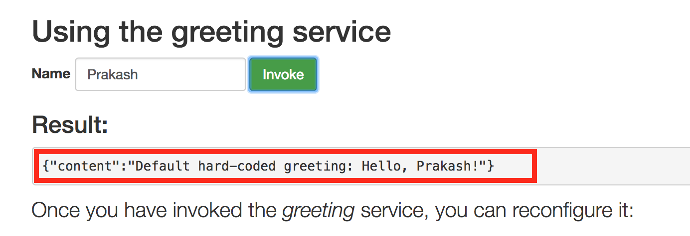

While the greeting code is functional, if you wanted to change the message you would need to stop the application, make the code change, and re-deploy. As you'll learn in the next section, in a real world application this may not be feasible and a mechanism to dynamically change the content is needed. You will add this using OpenShift ConfigMaps.

[[config-maps]]
== Add dependencies for ConfigMaps

=== What is a ConfigMap

ConfigMap is an object used by OpenShift to inject configuration data as simple key and value pairs into one or
more Linux containers while keeping the containers agnostic of OpenShift.
You can create a ConfigMap object in a variety of different ways, including using a YAML file, and inject it into the Linux container.
You can find more information about ConfigMap in the https://docs.openshift.org/latest/dev_guide/configmaps.html[OpenShift documentation].

=== Why ConfigMap is Important

It is important for an application’s configuration to be externalized and separate from its code. This allows for the application’s configuration to change as it moves through different environments while leaving the code unchanged. This also keeps sensitive or internal information out of your codebase and version control. Many languages and application servers provide environment variables to support externalizing an application’s configuration. Microservices and Linux containers increase the complexity of this by adding pods, or groups of containers representing a deployment, and polyglot environments. ConfigMaps enable application configuration to be externalized and used in individual Linux containers and pods in a language agnostic way. ConfigMaps also allow sets of configuration data to be easily grouped and scaled, which enables you to configure an arbitrarily large number of environments beyond the basic Dev, Stage, and Production.

=== Add NPM modules for ConfigMap support

The NPM package ecosystem contains projects that help implement various functionality in Node apps. To enable our sample Node app to access OpenShift ConfigMaps, you'll need to declare a dependency on a new package.

Execute the following command to insert the new dependencies into the package.json file:

`+npm install "openshift-rest-client@^1.0.1" --save-prod+`

This will download and install the needed dependency and update the link:src/package.json[package.json] file.

Using this package the application will be able to access its configuration from OpenShift using a ConfigMap. But you still need to implement the logic behind that access, which you'll do next.

[[coding]]
== Add Logic to Access ConfigMap

We are now ready to change our application to use ConfigMaps!

In the sample application is the hard-coded message that is returned to the caller of the service:

  let message = "Default hard-coded greeting: Hello, %s!";

We'll override this value by periodically retrieving a ConfigMap and overriding the value of message.

1) Add timed interval to retrieve configmap

In app.js add a new block of code that is executed every 2 seconds that retrieves the message value and overrides the variable.

  setInterval(() => {
  retrieveConfigMap().then(config => {
    if (!config) {
        message = null;
        return;
      }
    if (JSON.stringify(config) !== JSON.stringify(configMap)) {
      configMap = config;
      message = config.message;
      }
    }).catch((err) => {
    });
    }, 2000);

We are using https://javascript.info/promise-chaining[Promise chaining] to write efficient yet readable asynchronous method call chains to retrieve the ConfigMap.

The above method calls `+setInterval()+` https://nodejs.org/api/timers.html[(a Node.js interval timer)] to periodically invoke `+retrieveConfigMap()+` which
returns a promise object which will return the ConfigMap object named config and pass it to the callback to override the value of message.
We catch and ignore errors for the purposes of this sample.

Now that we have the logic in place to update the value, we need to implement the missing retrieveConfigMap() method which will need to return a promise to call into OpenShift and retrieve the ConfigMap content itself.

2) Add Configmap retrieval Logic

  // Find the Config Map
  const openshiftRestClient = require('openshift-rest-client');
  function retrieveConfigMap() {
  const settings = {
    request: {
      strictSSL: false
      }
    };
  return openshiftRestClient(settings).then(client => {
    const configMapName = 'app-config';
    return client.configmaps.find(configMapName).then(configMap => {
      return jsyaml.safeLoad(configMap.data['app-config.yml']);
    });
  });
}

In this code we are returning yet another promise which will be responsible
for using the https://www.npmjs.com/package/openshift-rest-client[openshift-rest-client]
module to make the call to the OpenShift REST API and retrieve the ConfigMap.

The use of promises and promise chaining may take a little getting used to,
but ultimately it results in an ordered and well-defined process to retrieve the ConfigMap from OpenShift, parse it into a Javascript-friendly JSON object, and use it to override the value of our message variable so that we can control its value externally, without requiring any changes in the application code.
The final chain called every 2 seconds looks something like:

  openshiftRestClient -> retrieve ConfigMap using .find('app-config') -> convert yaml to json ->  override message value

With our new logic in place, we can now create the actual ConfigMap within OpenShift which will contain the config vales accessed by the logic.

[[create-configmap]]
== Create ConfigMap Object

ConfigMaps can be created in a few different ways. For this example we will use
the oc command to create a ConfigMap based on the contents of the `+app-config.yml+` file included as part of the sample application.

1) Assign permissions

Applications needing to access ConfigMaps need permission to do so. Execute the below command to grant access to the application:

`+oc policy add-role-to-user view -n $(oc project -q) -z default+`

2) Create ConfigMap

Execute the below command to create the ConfigMap object. Since you're still logged into OpenShift,
and currently in the example project, the ConfigMap will be created there, and accessible from applications
running within this project.

`+oc create configmap app-config --from-file=app-config.yml+`

The name `+app-config+` is the same name as is used in the code in `+app.js+` to access the ConfigMap at runtime.

3) Verify that the ConfigMap is created

`+oc describe cm app-config+`

You should see the contents of the ConfigMap in the terminal window:

  Name:           app-config
  Namespace:      example
  Labels:         <none>
  Annotations:    <none>
  Data
  ====
  app-config.yml:
  ----
  message : "Hello, %s from a ConfigMap !"
  Events: <none>

The Data values of the ConfigMap contains key/value pairs, in this case a key of app-config.yml (derived from the name of the file from which the ConfigMap was initialized) which contains the configuration values. At runtime, the code you wrote in the last step accesses the ConfigMap using these names to read the content (in this case, the message value that we use in the app to customize the returned message at runtime).

Now that you have the application coded to read the ConfigMap, and have created the ConfigMap, it's time to re-deploy the application and test out our new functionality.

[[redeploy]]
== Redeploy to Openshift

With our code and ConfigMap in place, lets rebuild and redeploy using the same command as before. Execute the command:

`+npm run openshift+`

The rebuild and redeploy may take a minute or two. Wait for it to complete.

After the build finishes it will take less than a minute for the application to become available. To verify that everything is started, run the following command and wait for it report

`+oc rollout status dc/nodejs-configmap+`

Once the application is re-deployed, re-visit the sample UI by clicking the application
link from the openshift web console

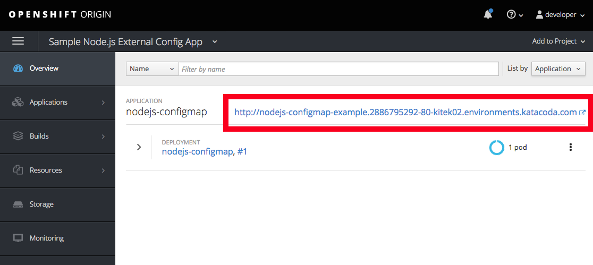

The application will now read the ConfigMap values and use them in place of the hard-coded default.

Test the deployed applications

Enter a name in the 'Name' field and click Invoke to test out the service. You should now see the updated message Hello, [name] from a ConfigMap ! indicating that the application successfully accessed the ConfigMap and used its value for the message.

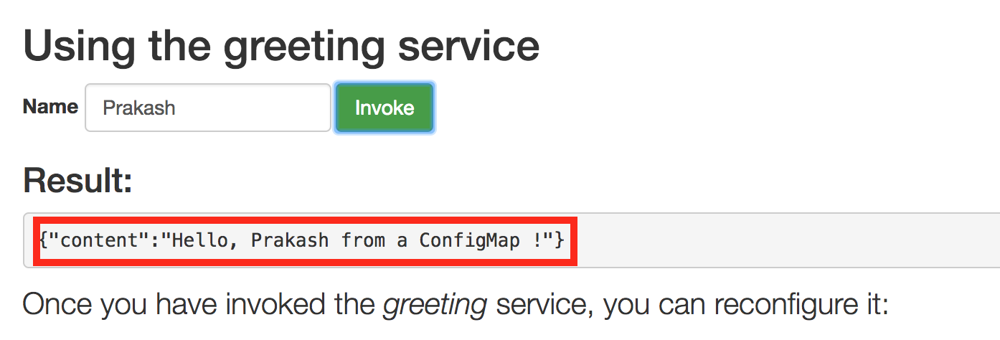

In the final step, we'll modify the ConfigMap and verify that the application successfully picks up the changes automatically.

[[modify-configmap]]
== Modify the ConfigMap

Modifying ConfigMaps can also be done in a few different ways. For this step we will use the OpenShift Web Console to graphically (and manually) update the ConfigMap. This could also be done programmatically if desired. Follow the below steps:

1) Modify the ConfigMap values

Return to the Openshift web Console

Select the example application as before to open the Overview page for the project:

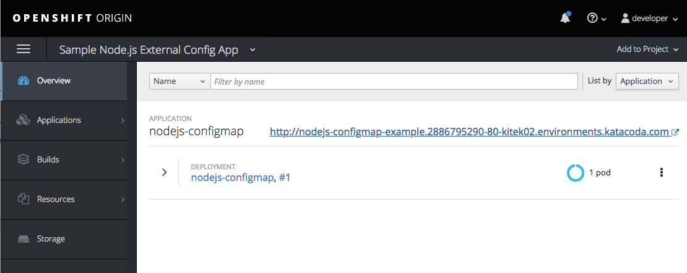

From here, navigate to Resources -> Config Maps to display a list of ConfigMaps:

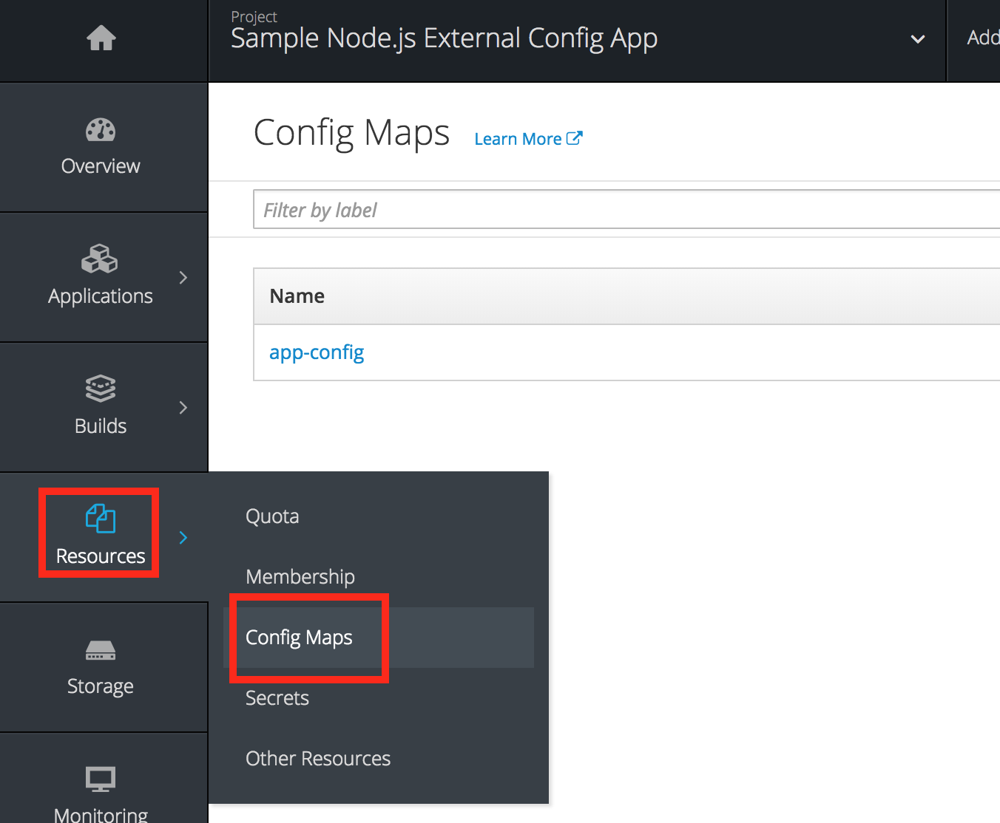

Click on the app-config ConfigMap to display the ConfigMap details:

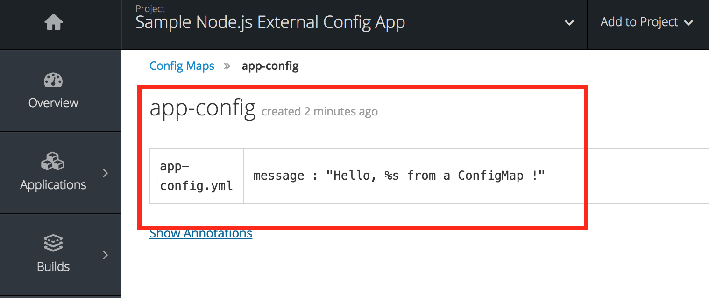

To change the value for message, click on the Actions button and select Edit:

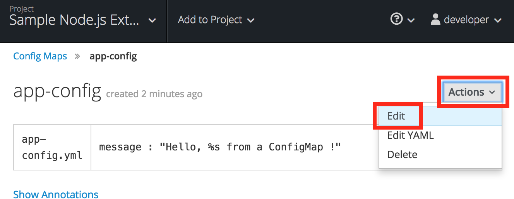

Replace the value of message by carefully changing the existing text. You can use %s as a placeholder for the name to be included in the greeting:

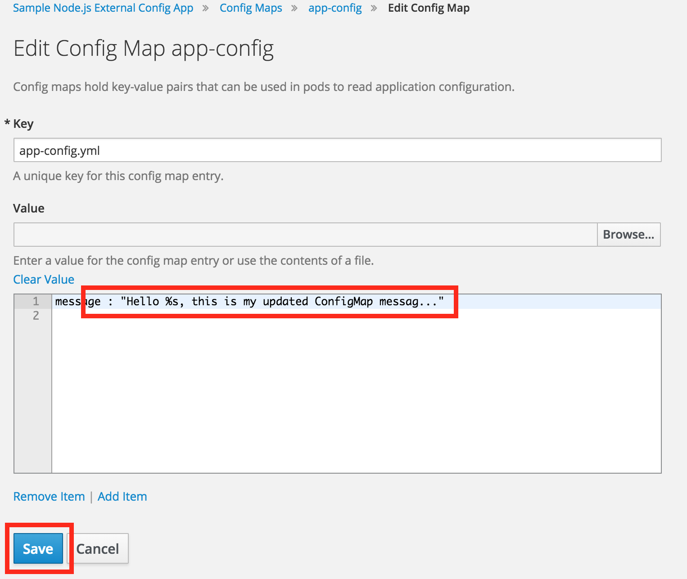

2) Verify the application has updated

Return to the application and type in your name into the Name field once again. Click the Invoke button to verify that the message returned is the same as what you supplied in the ConfigMap:

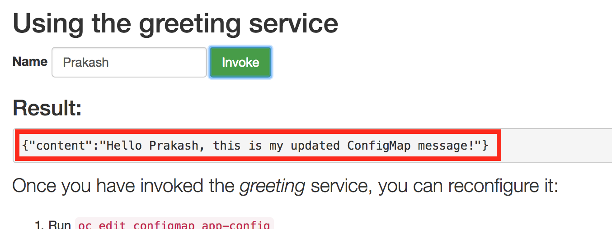

Congratulations!

Without changing a single line of code you were able to update the behavior of the application using OpenShift ConfigMaps.
